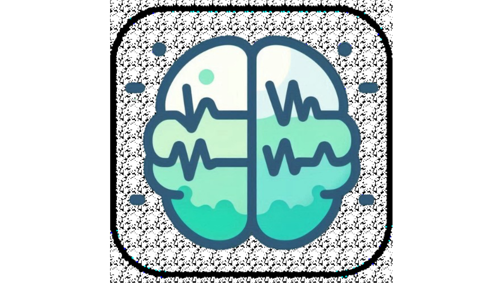

# About the app

## Project Motivation

  <h3>Origins</h3>
  Our engineering project was proposed in an academic context as part of the Engineering Project Teaching at Télécom Physique Strasbourg. This program connects engineering students with a diverse range of clients, including industry professionals, academic researchers, and medical practitioners in hospitals. These collaborations provide us with real-world projects to undertake over the course of one year.

---

## Medical Need

  

    <h3>Epilepsy: A Major Health Issue</h3>
    Epilepsy affects around 1% of the world's population. This neurological disease manifests in sudden seizures that can seriously impact quality of life. Effective treatment relies on detailed knowledge of seizure frequency, type, and brain origin.

    <h4>What Happens During a Seizure?</h4>
    Seizures stem from abnormal and excessive electrical activity in certain brain areas. This disrupts functions such as movement, speech, awareness, and perception. Localising the involved brain zone is crucial for diagnosis and potential surgery.

    <h4>Why Is Seizure Testing Carried Out?</h4>
    In hospitals, patients are monitored for seizures while undergoing real-time cognitive tests by nurses. These tests help map affected brain functions and localise seizure origins.

    <h4>Limitations of Current Testing</h4>
    Hospital testing often requires two-week stays and dedicated medical teams, resulting in long wait times, patient stress, and high healthcare costs.

  

  

    <h3>Our Solution</h3>

    <h4>A Mobile Seizure Testing App</h4>
    Cortest is an Android app that enables patients or caregivers to perform seizure testing at home or in hospitals, with or without trained staff. It guides users through tests, records responses and videos, and exports files for physicians.

    <h4>A Tool for Patients and Carers</h4>
    Cortest increases testing accessibility and reactivity. It also captures the critical first seconds of a seizure, aiding neurological analysis and potentially accelerating therapeutic decisions.

      
    

  

---

## Brain Functions & Testing

  

    <h3>Functions of the Brain</h3>
     
    
  

  

    <h3>Neurological Explanation</h3>
    During seizures, the patient's cognitive abilities are assessed to identify affected brain areas.
    
    Cards are used to stimulate various brain functions.
    
    

  

---

## Institutional Support

  

    

      
    

    

      
<strong>Lucas Gauer</strong>

      
Head of Clinic - Hospital Assistant

      
Doctor in Neuroscience

      
Strasbourg University Hospital - HUS

    

  

  

    

      
    

    

      
<strong>Télécom Physique Strasbourg</strong>

      
A French engineering school

    

  

